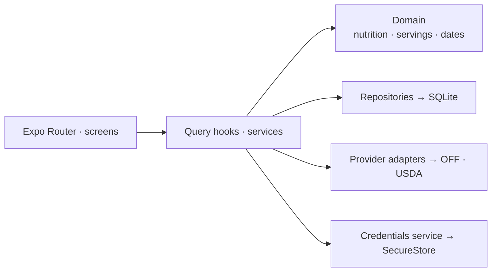

# Open Kcal

[](https://github.com/ricardo-reis-swe/open-kcal/actions/workflows/ci.yml)

A local-first calorie and food diary for iOS and Android. Set your goals, log foods
and recipes, and keep track of your daily calories and nutrients. Built with React
Native (Expo), with everything stored on the device in SQLite. No account, backend
or tracking.

<p align="center">
  
  
  
  
</p>

[Why it exists](#why-it-exists) · [Install](#install) · [Instructions](#instructions) · [Settings](#settings) · [On the home screen](#on-the-home-screen) · [Architecture](#architecture) · [Development](#development) · [Support the data underneath](#support-the-data-underneath)

## Support the data underneath

Food search uses [Open Food Facts](https://world.openfoodfacts.org) and
[USDA FoodData Central](https://fdc.nal.usda.gov). These databases provide the food
names, serving sizes and nutrition values behind the search results.

- **Support Open Food Facts** → [Contribute product data](https://world.openfoodfacts.org/contribute).
- Open Food Facts data is available under the [Open Database License (ODbL)](https://opendatacommons.org/licenses/odbl/1-0/).
- USDA FoodData Central data comes from the U.S. Department of Agriculture,
  Agricultural Research Service, and is public domain.

## Why it exists

A food diary should let you set your own goals and record what you eat while
keeping your diary on your phone. Open Kcal focuses on that daily routine: meals,
portions, calories, nutrients and body weight.

Your diary works offline, including custom foods, recipes and saved foods. Online
search and product lookups contact the food databases directly; there is no app
server or cloud sync.

English and European Portuguese are supported. Issues and suggestions welcome.

### Install

There are no published releases yet. For now, build from source using the
[development instructions](#development).

The [release workflow](.github/workflows/release.yml) prepares these files for the
[Releases](https://github.com/ricardo-reis-swe/open-kcal/releases) page:

| Platform | File | Installation |
| --- | --- | --- |
| Android | `open-kcal-<version>.apk` | Install the signed APK, allowing installation from your browser or file manager when Android asks. Obtainium can track this repository for updates. |
| iOS | `open-kcal-<version>.ipa` | Sign and sideload the unsigned IPA with AltStore, SideStore or Sideloadly. Free Apple ID signing needs refreshing every seven days. |

Releases also include `altstore-source.json` for AltStore / SideStore and
`SHA256SUMS.txt` for file checksums. Release preparation is documented in
[Releasing](docs/releasing.md).

### Instructions

**1 · Set your goals.** In **Profile**, open **Calories & macros** to enter your
daily targets. Configure your meals and preferred units there too.

**2 · Pick a day and meal.** The Diary shows calories left, macro totals and each
meal's entries. Use the date strip, arrows or calendar to change the day; past and
future days are editable too. Tap a meal's **+** to add food.

**3 · Find a food.** Search your own foods, saved foods, Open Food Facts or USDA.
You can also scan a product barcode. To enable USDA, follow
[Setting up USDA](#setting-up-usda); without a key, its search section is hidden.

**4 · Choose a portion and save.** Pick a serving unit, move the ruler to the amount
you ate, and watch calories and macros update. Save to add it to the diary. Tap an
existing entry to change its amount, unit or meal; swipe left to delete it. Entry
and meal menus let you copy to another date and meal.

**5 · Add your own foods and recipes.** Create a custom food from its nutrition
label, or a recipe from ingredients and a number of servings. Recipes can also
record raw and cooked weight per serving. Manage them in **Profile → My foods**
and **My recipes**. For a calories-only entry, use **Quick Calories** from the
bottom **+** button.

**6 · Record your weight.** Use **Update weight** in Profile. Your current weight,
goal and previous entries are available there.

### Settings

Settings live in **Profile** and save on the device.

| Setting | Meaning |
| --- | --- |
| Calories & macros | Daily calorie and carbohydrate, protein and fat targets. Goals are entered by you. |
| Weight goal / Weight history | Target body weight and your recorded weigh-ins. |
| Meals | Rename, add, delete and reorder meals. |
| Units | Body weight kg/lb, food weight g/oz, energy kcal/kJ and volume ml/fl oz. |
| Dashboard nutrients | Choose and reorder the extra nutrients shown in the Diary. |
| Food Databases | Add or remove your USDA key; reorder and show/hide food search sections. |
| My foods / My recipes | Manage custom foods and recipes. |
| Theme | System, Light or Dark; System is the default. |

The app follows your device's language and locale for translations, dates and
numbers. Food names, meal names and notes stay as you entered them.

#### Setting up USDA

USDA FoodData Central is optional. Open Food Facts works without a key, and your
local diary, custom foods and saved foods remain available without USDA.

1. Request your own free API key from [api.data.gov](https://api.data.gov/signup/).
   Complete the sign-up form and copy the key provided to you.
2. In the app, open **Profile → Food Databases** and tap **USDA**
   to expand it.
3. Paste the key into **USDA API key** and tap **Save key**. When online, the app
   tests it before saving. **Key works.** confirms that USDA accepted it.
4. Under **Search results** on the same screen, make sure **USDA** is enabled.
   Return to Food Search and try an English term such as `apple` or `eggs`.

The key is stored securely on that device. Enter it in the app, never in `.env`
or the source code. Use your own key; the app does not accept `DEMO_KEY`.

If you save while offline, the key is stored without verification. Once connected,
expand USDA and tap **Test key**. **Replace key** and **Remove key** are available
there too; removing the key stops USDA search but keeps your saved foods.

If USDA rejects the key, check that you copied it correctly. If it is over the
hourly limit, try again later; the [USDA API guide](https://fdc.nal.usda.gov/api-guide/)
documents the request limits. USDA food names are in English, so Portuguese search
terms may return no results.

### On the home screen

Android has a **Calories left** widget showing today's remaining calories. Add it
from your launcher's widget picker. It refreshes after diary changes and
periodically in the background, and follows the app's theme. Tap it to open the
Diary. There is no iOS widget.

### Architecture

Routes compose screens, screens dispatch actions, and services coordinate writes.
Nutrition math and unit conversions live in a pure domain layer. SQLite
repositories own the SQL; food provider adapters normalize remote responses before
they reach the UI.



The rules that hold it together:

- Diary writes commit to SQLite before the UI reports success.
- Entries keep nutrition snapshots, so editing a food does not rewrite old meals.
- Missing nutrients stay unknown; Quick Calories does not turn unknown macros into zero.
- The USDA key lives in secure device storage, never in SQLite, logs or the build.
- Hidden or unavailable providers receive no requests; local foods remain usable offline.

The approved specs use stable rule IDs. Start at [AGENTS.md](AGENTS.md) for the
reading map, [Scope](docs/01-scope.md) for requirements, [Data](docs/03-data.md) for
storage and nutrition rules, and [Architecture](docs/04-architecture.md) for the
layers and development conventions. Implementation status lives in
[Progress](docs/progress.md).

### Development

Use Node.js 24 (the CI version), plus Xcode on macOS for iOS and/or Android Studio
for Android. Native modules require an Expo development build.

```bash
git clone https://github.com/ricardo-reis-swe/open-kcal.git
cd open-kcal
npm ci
cp .env.example .env
npm run ios        # or: npm run android
```

`npm start` serves the JS bundle to the installed development build. The public
provider URLs and Open Food Facts contact are configured in `.env`; see
[.env.example](.env.example). For the USDA key, follow
[Setting up USDA](#setting-up-usda).

| Command | Does |
| --- | --- |
| `npm start` | Start Metro for the development build. |
| `npm run ios` / `npm run android` | Build and run the native app locally. |
| `npm run lint` | Run ESLint. |
| `npm run typecheck` | Check TypeScript without emitting files. |
| `npm test` | Run Jest tests. |
| `npm run check` | Run lint, type checking and tests. |
| `npm run format:check` | Check formatting for files covered by Prettier. |

Tests cover domain math, repositories, provider mapping, components and navigation.
CI runs formatting and `npm run check`. Automated Maestro device testing remains
deferred; see [Progress](docs/progress.md). Release builds and publishing steps are
in [Releasing](docs/releasing.md).

### License

[GNU GPL v3.0 or later](LICENSE) © 2026 Ricardo Reis. Anything built on this stays
open source.
