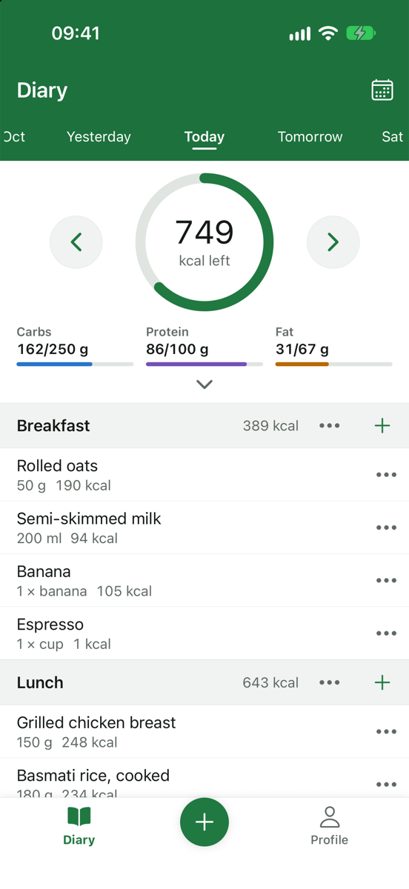
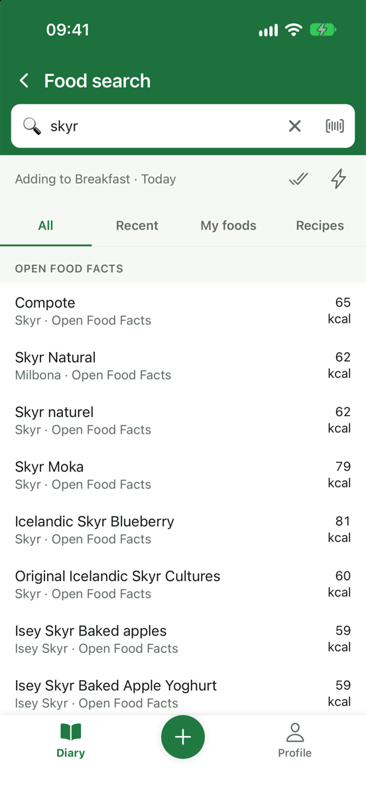
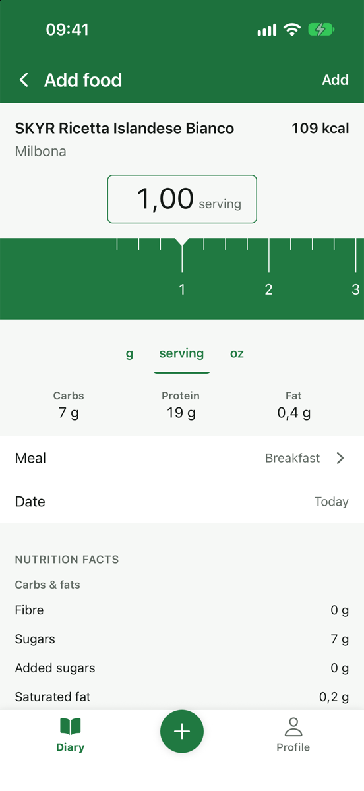
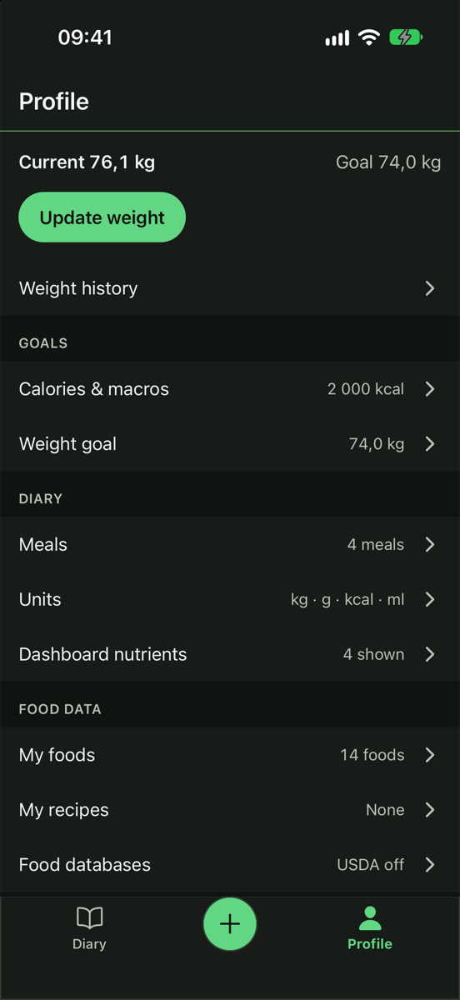

# Calorie Tracker

A local-first calorie and food diary for iOS and Android, built with React Native (Expo). Everything is stored on the device in SQLite. There is no account, no backend and no tracking.

<p align="center">
  
  
  
  
</p>

## Features

- Daily calorie, carb, protein and fat goals, with a diary per date (past, today and future).
- Configurable meals: rename, add, delete and reorder.
- Food search across your own foods, saved foods, [Open Food Facts](https://world.openfoodfacts.org) and [USDA FoodData Central](https://fdc.nal.usda.gov).
- Barcode scanning (EAN/UPC).
- Custom foods, recipes and Quick Calories entries.
- Ruler serving selector with live calorie and macro updates.
- Nutrient details beyond macros.
- Body weight: current, goal and history.
- Android home-screen widget showing today's calories left.
- English and Portuguese (Portugal).

## Running it

Requirements: Node.js, plus Xcode (iOS) and/or Android Studio (Android). The app uses native modules, so it runs as a development build, not in Expo Go.

```bash
npm ci
cp .env.example .env
npm run ios        # or: npm run android
```

Then `npm start` serves the JS bundle to the installed development build.

- In `.env`, set `EXPO_PUBLIC_OFF_CONTACT_EMAIL` to your own email. Open Food Facts asks apps to identify themselves with a contact in the `User-Agent`.
- USDA search needs a free API key from [api.data.gov](https://api.data.gov/signup/). Enter it in the app under Food Databases; it is kept in the device's secure storage and never in the build. Without a key, the USDA section is hidden.
- `npm run check` runs lint, type checking and tests.

## Specs

The app was built from specs written for coding agents: terse rules with stable IDs. Start at [AGENTS.md](AGENTS.md), which says which file to read for each task.

| Doc | Status |
|---|---|
| [01 Scope](docs/01-scope.md) | Approved |
| [02 Navigation](docs/02-navigation.md) + [routes.ts](src/shared/navigation/routes.ts) | Approved |
| [03 Data](docs/03-data.md) + [schema.sql](src/data/db/schema/schema.sql) | Approved |
| [04 Architecture](docs/04-architecture.md) | Approved |
| [05 Design system](docs/05-design.md) + [tokens.ts](src/shared/theme/tokens.ts) | Approved |
| [06 Screens](docs/06-screens.md) | Approved |
| [07 Food providers](docs/07-providers.md) | Approved |
| [08 Roadmap](docs/08-roadmap.md) | Approved |
| [Post-MVP backlog](docs/post-mvp.md) | Candidates only |

## Data sources

- Food data from [Open Food Facts](https://world.openfoodfacts.org), available under the [Open Database License (ODbL)](https://opendatacommons.org/licenses/odbl/1-0/).
- Food data from [USDA FoodData Central](https://fdc.nal.usda.gov), U.S. Department of Agriculture, Agricultural Research Service, public domain.

## License

Copyright (C) 2026 Ricardo Reis

This program is free software: you can redistribute it and/or modify it under the terms of the GNU General Public License as published by the Free Software Foundation, either version 3 of the License, or (at your option) any later version. See [LICENSE](LICENSE).
